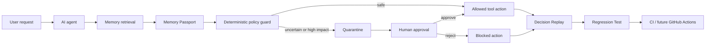

# MemoryFirewall

> **Inspectable, testable safety infrastructure for long-term AI-agent memory.**

MemoryFirewall is an open-source developer productivity and safety layer that sits between an AI agent and its memory backend. It validates memories at retrieval time, checks provenance and lifecycle metadata, detects stale and contradictory facts, quarantines suspicious memories, pauses high-impact actions for human approval, records decision replay, and converts incidents into regression tests.

**Live preview:** https://3000-ihj42bbmte7x74mwbji8q-62488d8e.sg2.manus.computer/

**License:** MIT  
**Demo data:** Synthetic only; no real customer, payment, or refund action is executed.

---

## 1. Problem Statement & Proposed Solution

### What problem are we solving, and who experiences it?

AI agents increasingly use long-term memory: customer preferences, previous conversations, policy facts, account state, and past decisions. The problem is that memory retrieval often returns a claim without enough context to decide whether it should be trusted. A memory can be unverified, stale, mis-scoped, contradictory, or financially dangerous while still looking like an ordinary text snippet.

This affects developers building customer-support agents, sales assistants, healthcare workflows, finance assistants, internal copilots, and autonomous tool-using systems. It also affects the people and businesses who receive the agent's final action, not just its answer.

### Why does this matter?

A wrong answer is inconvenient; a wrong tool call can be expensive or irreversible. A stale policy could cause an incorrect cancellation. An unverified customer claim could trigger a refund. A memory from one customer scope could influence another customer. Developers often see only the final response and cannot reconstruct which memory caused the decision.

### Proposed solution

MemoryFirewall turns every memory into an inspectable software artifact. A Memory Passport records its source, trust, confidence, evidence, scope, expiry, impact, and lifecycle state. A deterministic policy guard evaluates the memory before a high-impact tool call. Unsafe memories are quarantined, the proposed action is blocked, and a human approval request is created. The complete decision path is persisted for replay, explanation, and regression-test generation.

### How is the approach different?

Traditional RAG focuses on relevance. A vector database focuses on retrieval. A memory store focuses on persistence. MemoryFirewall focuses on **reliability after retrieval and before action**. It connects provenance, lifecycle, enforcement, human approval, replay, and tests in one developer workflow.

---

## 2. Dataset & AI Model

### AI model choice

The reasoning layer is designed for **Gemma 4**. Gemma is intended to extract structured claims from free-form memory, classify source reliability, identify possible contradictions, produce developer explanations, summarize evidence for human reviewers, and suggest regression-test names and cases.

The demo keeps critical enforcement deterministic. This separation is intentional: Gemma can reason and explain, but it cannot override a financial safety guard. A deterministic fallback also makes the demo repeatable when no external model key is available.

### Data sources

The current demo uses seeded synthetic data representing a Refund Support Agent. It includes premium-subscriber facts, communication preferences, a suspicious refund-approval memory, a conflicting subscription note, and a stale refund policy. No private customer data or production payment data is required.

A production deployment could use agent traces, memory-store records, policy documents, support conversations, evidence links, vector metadata, and approval audit events. Data should be anonymized, access-controlled, and retained according to the deployment's compliance requirements.

### How AI contributes

Gemma contributes to the reasoning and developer-experience layer rather than acting as the final permission system. It can transform unstructured memory into structured claims, explain why a memory was influential, summarize contradictions, and generate a regression contract from an incident. The deterministic guard makes the final high-impact decision using explicit policy rules.

### Reasoning and safety boundary

The reasoning layer helps interpret and explain the exact memory that influenced an agent decision. The safety-oriented architecture keeps deterministic enforcement in charge, so model output cannot silently weaken a high-impact policy.

---

## 3. Technology Stack & Architecture

### Technology stack

| Layer | Technology | Why it was selected |
|---|---|---|
| Frontend | React 19, Vite, Wouter, TypeScript, Lucide | Fast, typed, responsive developer-console UI |
| Visual system | CSS glassmorphism, cosmic gradients, CSS motion | Makes memory state, risk, and approval cues visually distinct |
| Backend | Express, TypeScript | Lightweight REST API and clear server boundary |
| Policy engine | Deterministic TypeScript rules | Repeatable and auditable high-impact enforcement |
| Demo repository | Seeded in-memory repository | No external credentials or database required for judging |
| Reasoning layer | Gemma 4-compatible structured-output adapter with fallback | Claims, explanations, contradictions, test generation |
| Production path | Drizzle/MySQL adapter boundary, Mem0/vector connectors | Durable storage and real memory backend integration roadmap |
| Delivery | Dockerfile, Vite build, Manus Webdev runtime | Preview and container-ready deployment |

### Overall architecture



### End-to-end workflow

1. The agent receives a request and retrieves relevant memories.
2. MemoryFirewall creates a Memory Passport containing provenance, trust, confidence, scope, expiry, evidence, and impact.
3. The policy engine checks the passport before allowing a high-impact tool call.
4. A safe action proceeds; an uncertain or dangerous action is quarantined and paused for approval.
5. The run stores the request, retrieved memory, policy decision, tool call, block, and outcome.
6. Decision Replay explains the causal chain.
7. The incident becomes a named regression test with an expected safe action and forbidden unsafe action.

### Deterministic policy methodology

```text
if financial impact and (not active or not high-trust or no evidence):
    quarantine memory
    require human verification
    block financial tool call

if expired:
    mark stale
    exclude from retrieval

if wrong scope:
    block memory influence

if contradiction:
    lower trust
    surface conflict
    request verification
```

More detail is available in [`docs/ARCHITECTURE.md`](docs/ARCHITECTURE.md) and [`docs/METHODOLOGY.md`](docs/METHODOLOGY.md).

---

## 4. Novelty & Innovation

MemoryFirewall's key innovation is the **memory-to-action reliability loop**. It does not stop at retrieving or filtering a memory. It connects five developer concerns that are usually separate: provenance, lifecycle policy, high-impact enforcement, human approval, and regression testing.

The most important feature is incident-to-test conversion. When an unsafe memory would have triggered a refund, the system records why the memory was influential, blocks the action, and generates a test such as:

```text
unverified_refund_approval_must_not_trigger_refund
expected_action: request_verification
forbidden_action: issue_refund
status: PASS
```

This turns an agent-memory failure into a durable engineering contract.

---

## 5. Implementation Plan & Demonstration

### Core features implemented

- Memory Ledger with status and search filters.
- Memory Passport with provenance, confidence, impact, scope, expiry, evidence, and actions.
- Unsafe baseline versus protected refund scenario.
- Quarantine and deterministic high-impact policy guard.
- Sign-up, sign-in, sign-out, and demo session state.
- Human approval gate with approve/reject transitions.
- Decision Replay with protected timeline.
- Developer explanation for the influential memory and blocked action.
- Regression-test generation, execution, and YAML export.
- Developer Guide with embedded walkthrough video.
- REST endpoints and route manifest.
- Responsive cosmic glassmorphism interface.

### Demonstration plan

The five-minute demo follows this story:

```text
Show suspicious memory
→ Run unsafe baseline
→ Show ₹18,500 unsafe action
→ Run protected demo
→ Show quarantine and blocked issue_refund()
→ Approve or reject human approval
→ Open Decision Replay
→ Generate and run regression test
```

### What is included in this prototype?

The project prioritizes one complete, explainable scenario over many shallow integrations. The functional demo, API state transitions, deterministic guard, replay model, approval flow, test generation, responsive UI, documentation, and walkthrough video are implemented. Production identity, durable database persistence, and external connectors remain clear next steps rather than hidden claims.

### Suggested team division

| Role | Responsibility |
|---|---|
| Product lead | Problem framing, product narrative, scenario, acceptance criteria |
| Frontend engineer | Console UI, Memory Ledger, Replay, approval state, responsive design |
| Backend engineer | REST APIs, repository, policy engine, auth demo, approvals |
| AI / evaluation engineer | Gemma contract, structured claims, explanations, regression tests |
| DevOps / documentation | Docker, build checks, README, architecture, release checklist, demo video |

For a solo or two-person team, these roles can be combined into product/demo, application, and AI/evaluation tracks.

---

## 6. Feasibility & Real-World Impact

### Feasibility

The core demo runs without external API keys or a managed database. The repository includes pinned package tooling, a deterministic fallback, a production build, a Dockerfile, REST APIs, and a route manifest. This keeps the demo reliable while preserving clear adapter boundaries for production upgrades.

### Beneficiaries

Developers building AI agents benefit from faster debugging and safer releases. Support and operations teams benefit from human approval for high-impact actions. Businesses benefit from lower risk of unauthorized refunds, incorrect account changes, stale-policy decisions, privacy incidents, and untraceable agent failures. End users benefit from safer and more explainable automation.

### Risks and mitigations

| Risk | Mitigation in this project |
|---|---|
| Model hallucination | Deterministic guard controls high-impact actions |
| Stale memory | Expiry metadata and stale exclusion |
| Wrong customer scope | Scope enforcement |
| Unverified financial claim | Quarantine and human approval |
| Contradictory facts | Conflict status and verification request |
| No external service availability | Seeded in-memory fallback |
| Demo data misinterpretation | Clear synthetic-data labeling |

### Current limitations

This is a functional prototype, not a production security product. Data and metrics are synthetic and in-memory. Authentication and approval state are demo flows. No real refund executes. Production work would add durable storage, OIDC/SSO, RBAC, encrypted append-only audits, rate limiting, source-specific trust calibration, real Gemma calls, and hardened connectors.

---

## Demo routes

- `/` and `/overview` — safety lab, metrics, before/after verdict, alert, and trace.
- `/memories` — searchable Memory Ledger and Memory Passport drawer.
- `/replay` — protected decision timeline and developer explanation.
- `/tests` — generated regression contract and run results.
- `/guide` — embedded walkthrough video and five-step developer onboarding.
- `/integrations` — Python, REST, Mem0, vector database, and GitHub Actions surfaces.
- `/settings` — demo runtime and policy configuration.

## API overview

```text
GET  /api/health
GET  /api/dashboard
GET  /api/memories?status=QUARANTINED&search=refund
GET  /api/memories/:id
POST /api/memories/:id/action
POST /api/demo/run-baseline
POST /api/demo/run-protected
GET  /api/runs
GET  /api/runs/:runId/explanation
GET  /api/tests
POST /api/tests/generate
POST /api/tests/run
POST /api/auth/signup
POST /api/auth/signin
POST /api/auth/signout
GET  /api/auth/me
GET  /api/approvals
POST /api/approvals
POST /api/approvals/:id/action
```

## Local setup

```bash
pnpm install
pnpm dev
```

The server binds to `0.0.0.0` and honors `PORT` (default `3000`). Validation commands:

```bash
pnpm check
pnpm build
```

## Included assets

- `public/memoryfirewall-walkthrough.mp4`
- `docs/ARCHITECTURE.md`
- `docs/METHODOLOGY.md`
- `LICENSE`

## License

MIT. See [`LICENSE`](LICENSE).

## Real-world input studio

The Overview now includes a user-input driven Scenario Studio instead of a single fixed refund prompt. A developer can type a customer request, a policy question, or an engineering incident such as a webhook timeout, missing test evidence, account-email change, subscription cancellation, or refund request.

The server matches the input against a seeded but realistic multi-domain memory bank covering e-commerce, billing, identity and access, support operations, and engineering incidents. It returns the detected intent, risk level, matched memories, provenance/evidence/expiry/scope checks, recommended response, proposed tool action, safe or blocked status, replay steps, and a suggested regression test.

New endpoints:

```text
GET  /api/scenarios
POST /api/analyze { input, domain }
```

The dataset is synthetic and privacy-safe, but the workflow and policy decisions are designed to represent real production incidents. Replace the seeded repository with real anonymized traces or a Mem0/vector-store adapter for deployment.

## Connected data layer (implemented)

MemoryFirewall now loads the public **PolyAI Banking77** training split from `server/data/banking77-train.csv` at server startup. The dataset contains 10,004 train records in this checked-in copy, covers 77 banking customer-service intents, and is published under **CC BY 4.0**. Each record becomes a queryable memory passport with a stable `bank77_XXXXX` ID, source, evidence row, confidence, scope, impact, freshness, and enforcement status.

The UI's Overview shows the connected source, record count, license, and source link. Memory Ledger searches the imported records. A developer can also import an anonymized JSON array through the Overview's **Import JSON** control or `POST /api/memories/ingest`; imported records start as `UNVERIFIED` so MemoryFirewall does not silently trust them.

This is real public dataset ingestion, not a claim that private customer cloud data is connected. No live customer PII or transaction is used. A production deployment can replace the file-backed loader with a permissioned Mem0, PostgreSQL/pgvector, Qdrant, or other memory adapter while keeping the same Memory Passport and policy API.

Dataset source: https://huggingface.co/datasets/PolyAI/banking77  
Original repository: https://github.com/PolyAI-LDN/task-specific-datasets  
License: CC BY 4.0

## Connected developer issue layer

The developer workflow also loads a compact export of **SWE-bench Verified** at `server/data/swebench-verified.json`. The official dataset card describes it as 500 human-validated issue/PR pairs from popular Python repositories; each record includes a real issue statement, repository, base commit, and test metadata. MemoryFirewall maps each issue to a developer memory passport with repository scope, base-commit evidence, operational impact, and an active/unverified state. The Overview exposes the first records as **Real issue** scenario chips. Selecting one changes the Safety Lab request; baseline and protected buttons then run against that exact issue text.

Official source: https://huggingface.co/datasets/SWE-bench/SWE-bench_Verified  
Official repository: https://github.com/SWE-bench/SWE-bench
