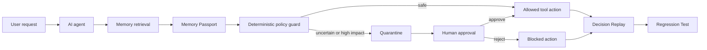

# MemoryFirewall Architecture

## System goal

MemoryFirewall sits between an AI agent and its long-term memory backend. It turns memory from an opaque retrieval result into an inspectable, testable, lifecycle-managed artifact.

## High-level workflow



## Runtime components

| Layer | Technology | Responsibility |
|---|---|---|
| Presentation | React 19, Vite, Wouter, Tailwind-compatible CSS, Lucide | Console UI, responsive workflow, Memory Ledger, replay and tests |
| API | Express, TypeScript | REST endpoints, auth demo, approval transitions, demo orchestration |
| Policy | Deterministic TypeScript rules | High-impact enforcement, expiry, scope, trust, evidence and quarantine |
| Repository | Seeded in-memory repository | Repeatable synthetic judging data and fallback when no database is configured |
| Reasoning adapter | Gemma 4-compatible contract with deterministic fallback | Structured claims, explanations, conflict classification, test naming |
| Delivery | Manus Webdev runtime, Dockerfile, Vite production build | Preview, container-ready server and static assets |

## Memory Passport

Each memory has:

- stable ID
- content
- status
- source and source trust
- confidence
- impact category
- scope
- created and updated timestamps
- expiry timestamp
- evidence references
- decision usage metadata

## Policy engine

The enforcement layer is deliberately deterministic:

```text
if financial impact and (not active or not high-trust or no evidence):
    quarantine memory
    require human verification
    block financial tool call

if expired:
    mark stale
    exclude from retrieval

if wrong scope:
    block memory influence

if contradiction:
    lower trust
    surface conflict
    request verification
```

This separation ensures that reasoning-model availability or a model explanation cannot weaken a critical safety decision.

## API workflow

1. `POST /api/demo/run-protected` creates a protected run with a decision trace.
2. `POST /api/approvals` creates a pending human approval request.
3. `POST /api/approvals/:id/action` records approve/reject state.
4. `GET /api/runs/:runId/explanation` returns the developer explanation.
5. `POST /api/tests/generate` converts the incident into a regression contract.
6. `POST /api/tests/run` evaluates the protected expectation.

## Production evolution

The current repository boundary is intentionally simple so a durable adapter can replace the in-memory store later:

- MySQL/Drizzle for durable memories, runs, approvals and tests
- Mem0-compatible adapter for memory storage
- Vector database pre-filtering for retrieval
- OIDC/SSO and RBAC for identity and approvals
- Append-only audit storage for regulated workflows
- GitHub Actions integration for regression tests
- Gemma 4 structured-output adapter for reasoning tasks
